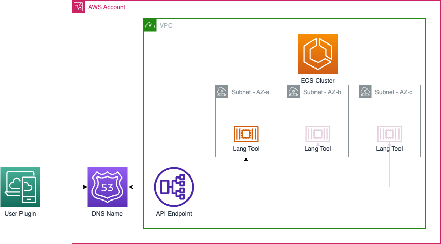
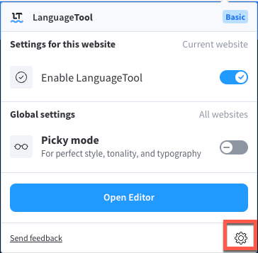
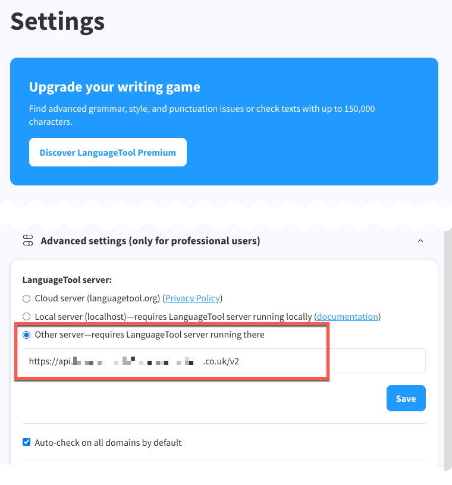

# AWS CDK Stack for the LanguageTool deployment on the AWS Cloud

This repository contains a AWS CDK definition to deploy [LanguageTool](https://github.com/languagetool-org/languagetool) as containerized application container on AWS Cloud, using AWS Elastic Container Server with AWS Fargate. 

> [LanguageTool](https://www.languagetool.org/) is an Open Source proofreading software for English, French, German, Polish, Russian, and [more than 20 other languages](https://languagetool.org/languages/). It finds many errors that a simple spell checker cannot detect.

Deployment rely on the Dockerfile to create a Docker image from the [docker-languagetool](https://github.com/Erikvl87/docker-languagetool/tree/master).

# Infrastructure  

The following infrastructure will be deployed to support the language tool execution on the AWS Cloud:

**Figure 1. Infrastructure**


# Pre-requisites
For the deployment you need to have the following dependencies:
- AWS Account
- Docker installed on you machine
- AWS CDK installed on you machine
- GoLang installed on you machine
- DNS zone delegated to Route53

# Deployment

To deploy the application into the AWS Cloud, you need to configure your aws credentials. 

### Set the following environment variables

| Variable | Description |
|-|-|
| hostedZoneID | Route53 hosted zone ID. |
| hostedZoneName | Route53 hosted zone name. | 
| langToolDomainName | domain name to be used by the language |
| langToolAPIName | subdomain to be used by the language API Access |
| langToolWebName | subdomain to be used by the language Web Access |


Example:
```sh
export hostedZoneID=ZXXXXXXXXXXXXXXXXXX2
export hostedZoneName=example.co.uk
export langToolDomainName=languagetoolv2.example.co.uk
export langToolAPIName=api
export langToolWebName=web
```
### Initiate deployment

```sh
git clone https://github.com/mrvladis/aws-language-tool.git --config core.autocrlf=input
git clone https://github.com/Erikvl87/docker-languagetool.git ./language-tool-ecs-fargate/docker/
cd language-tool-ecs-fargate/cdk
cdk bootstrap
cdk deploy

```

# Plugin configuration

Language Tool has a plugin for Chrome. 

Grammar Checker & Paraphraser – LanguageTool

https://languagetool.org/chrome 







